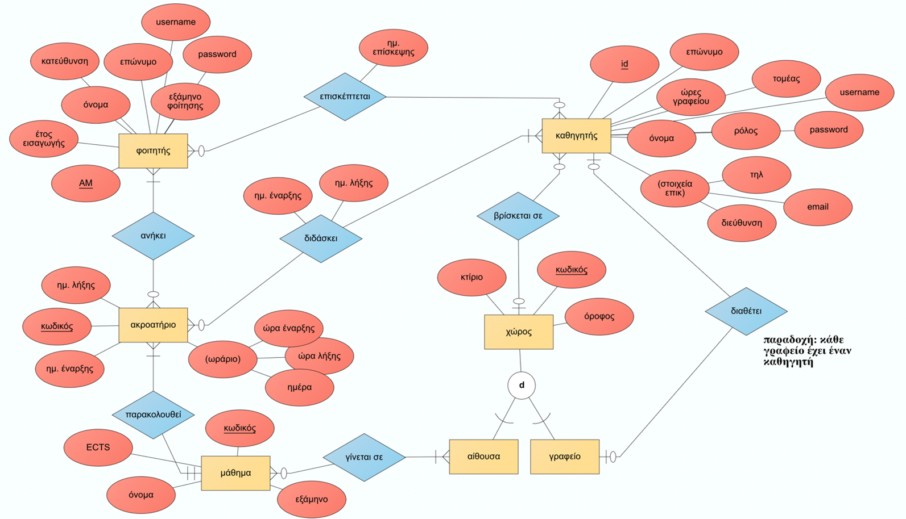
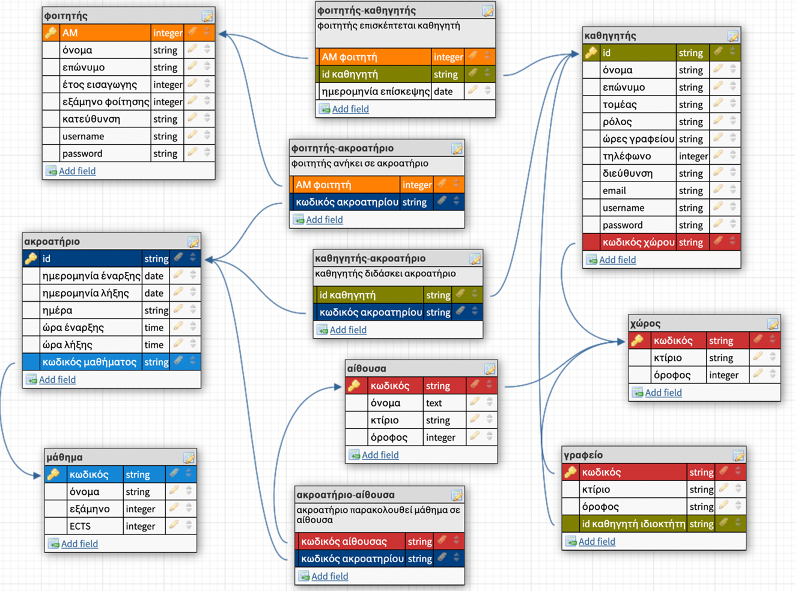

# Unical
# Περιγραφή του Project
Το Project δημιουργήθηκε στα πλαίσια του μαθήματος Βάσεις Δεδομένων (ECE_ΓK703) το τμήματος Ηλεκτρολόγων Μηχανικών και Τεχνολογίας Υπολογιστών του Πανεπιστημίου Πατρών.

**Μπορείτε να κατεβάσετε όλα τα περιεχόμενα σε αρχείο .zip από [εδώ](https://github.com/symeona17/ECE_UPatras-Databases-Unical).**

Δημιουργοί:
- Μπουμπουκιώτη Μαρία-Ελένη, ΑΜ:1072880
- Συμεωνίδης Ανδρέας, ΑΜ:1066573

## Περιεχόμενα:
- [ERD διάγραμμα](ERD.png)
- [Λογικό σχεσιακό διάγραμμα](Logic_Model.png)
- [Αρχείο για την δημιουργία της βάσης δεδομένων](UniCal.db.sql)
- [Αρχείο βάσης δεδομένων](UniCal.db)
- [Κώδικας εφαρμογής σε Python](program.py)
- [Εκτελέσιμο .exe αρχείο](program.exe)
- [Σύντομη Παρουσίαση](Databases-Presentation.pdf)
- [Αναφορά](Αναφορά.pdf)

***Προσοχή: Το εκτελέσιμο αρχείο (.py ή .exe) πρέπει να βρίσκεται στον ίδιο φάκελο με το .db αρχείο για να λειτουργεί σωστά η εφαρμογή!***
Το Antivirus του υπολογιστή σας πιθανώς να μην επιτρέψει την εκτέλεση του .exe αρχείου. Μπορείτε να το προσθέσετε στις εξαιρέσεις.

## Φάση Α: Δημιουργία του εννοιολογικού μοντέλου της βάσης δεδομένων και του αντίστοιχου λογικού σχεσιακού διαγράμματος

Στην παρακάτω εικόνα μπορείτε να δείτε το εννοιολογικό μοντέλο που αναπτύχθηκε για την εφαρμογή μας:

 

Μετά την ολοκλήρωση του ERD μοντέλου, το μετασχηματίσαμε στο αντίστοιχο λογικό μοντέλο (schema) το οποίο φαίνεται στην παρακάτω εικόνα:

 

## Φάση Β: Υλοποίηση της βάσης δεδομένων και queries SQL

- [Αρχείο για την δημιουργία της βάσης δεδομένων](UniCal.db.sql)
- [Αρχείο βάσης δεδομένων](UniCal.db)

## Φάση Γ: Δημιουργία εφαρμογής για αλληλλεπίδραση με την βάση σε Python

- [Κώδικας εφαρμογής σε Python](program.py)
- [Εκτελέσιμο .exe αρχείο](program.exe) (δημιουργήθηκε με χρήση του πακέτου pyinstaller)
